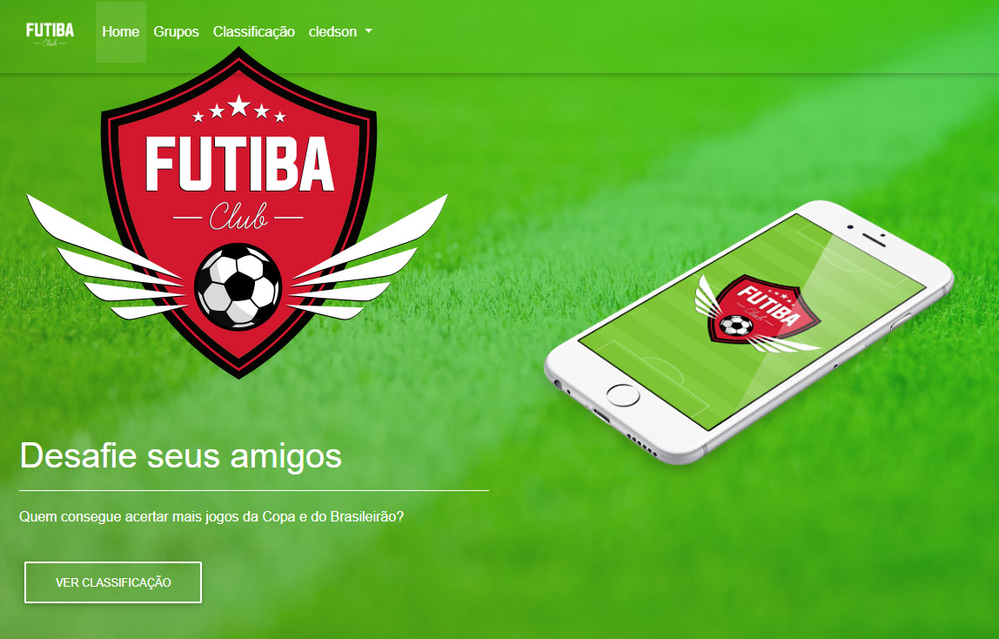

<p align="center">
   
</p>

# Futiba Club

This project is part of the [Devpleno](http://devpleno.com/) course and consists of a website that the users can create groups for friends rate their soccer teams.

We mainly use [React](https://reactjs.org), [Express](https://expressjs.com/) and [Bootstrap](https://getbootstrap.com/). [MySQL](https://www.mysql.com/) was used to record the data from the form.

<br />
<p align="center">
    
</p>

# Guide

* [Features](#features)
* [Installation](#installation)
* [Technologies](#technologies)
* [Future Implementations](#future-implementations)


# Features

*  Users can create groups and can add and exclude them.
*  Users can give sugestions about soccer games and create classifications.


# Installation

**You will need install:**

 [Node.js](https://nodejs.org/en/download/) <br />
 [Npm](https://www.npmjs.com/) 

**Install dependencies**

```npm install```


**Run the application:**

```node index.js```

# Technologies

* [NodeJS](https://nodejs.org/en/) to handle the server, 
* [React](https://reactjs.org) to handle the rendering, 
* [Express](https://expressjs.com/)
* [Bootstrap](https://getbootstrap.com/) to handle styles and layout
* [MySQL](https://www.mysql.com/)  to record data

# Future Implementations

We could add some placar and TOP 5 users.

Thanks to [Tulio Faria](https://github.com/tuliofaria) from [Devpleno](http://devpleno.com/).
##

